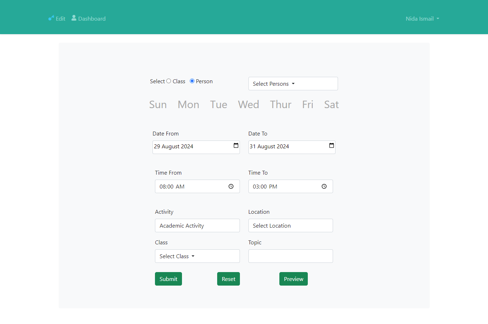

# Scheduling System
The is the first version Schedular and it was entirely changed and added in the Github with name [Schedular](https://github.com/nidaismail/Scheduler)

## Table of contents

- [Screenshot](#screenshot)
- [Links](#links)
- [My process](#my-process)
  - [Built with](#built-with)
  - [What I learned](#what-i-learned)
- [Author](#author)

### Screenshot

### Links

- Solution URL: [Github](https://github.com/nidaismail/Schedular-Old)
- Live Site URL: [Cloud](https://schedular.imdcollege.edu.pk/)

## My process

The project is made using laravel, firstly i set up all the view files then the controller files then models along with the tables in mySQL.

### Built with

- PHP (Laravel)
- HTML
- CSS
- JS
- JSON
- MYSQL

### What I learned

## Author

- Nida Ismail
